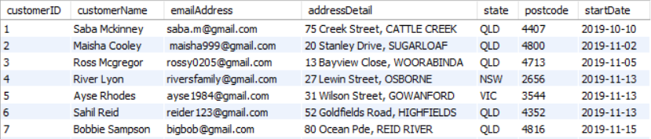
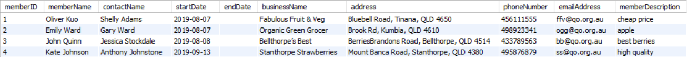
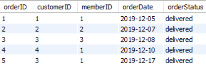
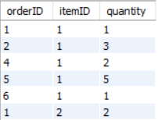
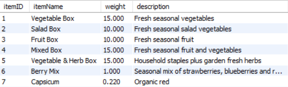
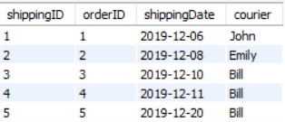
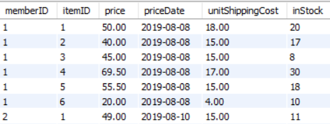
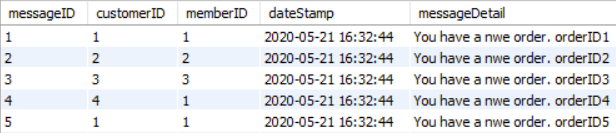
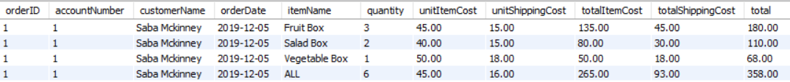
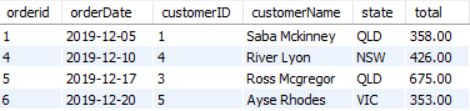

# qld_organics_database
Design and implement a database for Queensland Organics(QO).
QO is an organization that helps the farmers (member) in QLD better sell and distribute their products.
The gaol of this project is to help QO to trnasmit from spreadsheets to databases.

The database is designed as followed.

The relational schema:

customer table:

member table:

order table:

order item table:

product item table:

shipping table:

stock table:

message table:

Queries:
1. SELECT statement that will display the following data for a customer order:
• customer name and account number;
• order number/id and the total amount for the order;
• order date;
o item name;
o quantity;
o price;
o shipping cost;
o item total cost.

2. SELECT statement that will produce a report of the orders from a particular co-op member within a specified period of time:

• List all orders between a start-date and an end-date for a particular co-op member such that:
o the report will be grouped by customer;
o each line in the report will include the customer name, customer state, order number/id and total for that order;
o will be ordered by the oldest order to the most recent order.

