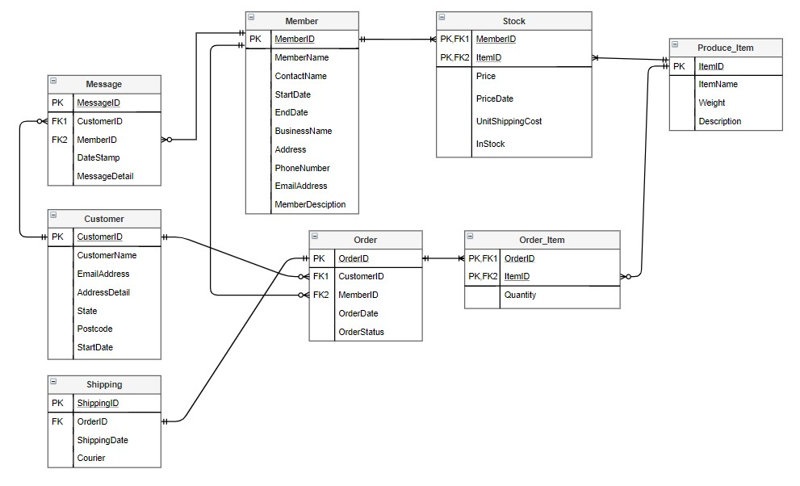
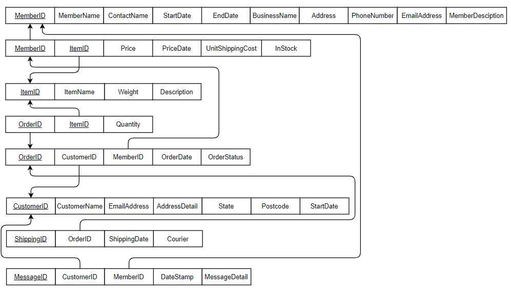

# qld_organics_database
Design and implement a database for Queensland Organics(QO).
QO is an organization that helps the farmers (member) in QLD better sell and distribute their products.
The gaol of this project is to help QO to trnasmit from spreadsheets to databases.
The database is designed as followed.

The relational schema:

customer table:
member table:
order table:
order item table:
product item table:
shipping table:
stock table:
message table:
